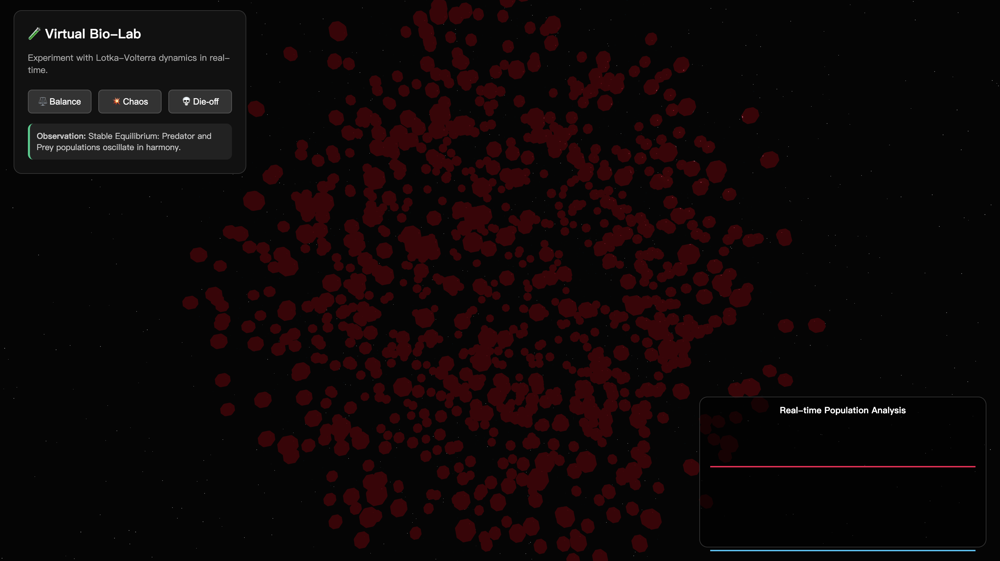

# MicroCosmos-3D 🧬


> **A real-time, interactive 3D simulation of microbial population dynamics.**
> Bridging the gap between computational biology and modern web graphics.


---

## 📖 Overview

**MicroCosmos-3D** is a "virtual laboratory" designed to visualize the mathematical beauty of ecological stability and chaos. Unlike static charts, this application simulates a living ecosystem of **3,000+ interactive particles** driven by differential equations in real-time.

Built with **Next.js** and **React Three Fiber**, it demonstrates how complex scientific models—specifically the **Generalized Lotka-Volterra (GLV)** equations—can be rendered accessible and intuitive through high-performance web engineering.

<div align="center">
  
</div>
---

## ⚡ Key Features

### 🧪 Virtual Bio-Lab (Interactive Experiments)
Users act as researchers, manipulating environmental parameters to observe distinct ecological phenomena:
* **⚖️ Stable Equilibrium**: Achieve a delicate balance where predator and prey populations oscillate in harmony.
* **💥 Chaotic Explosion**: Simulate high-growth environments leading to population spikes and instability.
* **💀 Mass Extinction**: Observe how harsh interaction coefficients lead to system collapse.

### 📊 Real-Time Analytics
* **Scientific Visualization**: Integrated **Recharts** to plot live population data (N) over time (t).
* **Data-Driven**: Visuals are not pre-rendered animations; they are the direct output of the mathematical model running at 60 FPS.

### 🚀 High-Performance Engineering
* **Instanced Mesh Rendering**: Utilizes GPU instancing to render thousands of individual particles with minimal CPU overhead.
* **Euler Integration**: Implements a custom numerical solver for ordinary differential equations (ODEs) in JavaScript/TypeScript.

---

## 🧮 The Mathematics (GLV Model)

The simulation solves the Generalized Lotka-Volterra equations for $N$ interacting species:

$$\frac{dN_i}{dt} = N_i \left( r_i + \sum_{j=1}^{N} A_{ij} N_j \right)$$

Where:
* $N_i$: Population abundance of species $i$.
* $r_i$: Intrinsic growth rate (positive for prey, negative for obligate predators).
* $A_{ij}$: Interaction coefficient (effect of species $j$ on species $i$).

In this simulation:
* 🔴 **Species A (Red)**: The Predator.
* 🟢 **Species B (Green)**: The Prey.
* 🔵 **Species C (Blue)**: The Competitor.

---

## 🛠️ Tech Stack

* **Frontend Framework**: Next.js 14 (App Router)
* **Language**: TypeScript
* **3D Engine**: React Three Fiber (Three.js ecosystem)
* **Data Visualization**: Recharts
* **Styling**: Inline CSS / Tailwind
* **Deployment**: Vercel

---

## 🚀 Getting Started

1.  **Clone the repository**
    ```bash
    git clone [https://github.com/LuvKe0214/microcosmos-3d.git](https://github.com/LuvKe0214/microcosmos-3d.git)
    cd microcosmos-3d
    ```

2.  **Install dependencies**
    ```bash
    npm install
    ```

3.  **Run the development server**
    ```bash
    npm run dev
    ```
    Open [http://localhost:3000](http://localhost:3000) to view the simulation.

---


---

## 📝 License

Distributed under the MIT License.